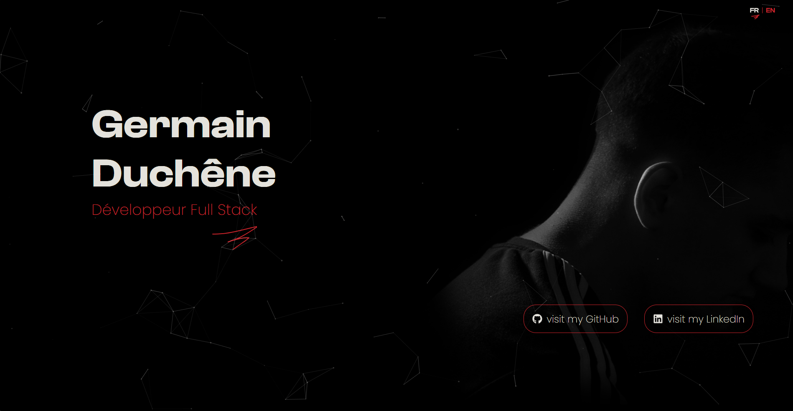

# Portfolio de Germain Duchêne

[](https://germain.duchene.dev)
[](https://github.com/ton-compte/portfolio/actions)
[](https://nodejs.org/)
[](https://www.typescriptlang.org/)
[](https://preactjs.com/)
[](https://vitejs.dev/)
[](https://sass-lang.com/)
[](https://greensock.com/gsap/)

## 📑 Table des matières

- [À propos](#-à-propos)  
- [Aperçu](#-aperçu)  
- [Compétences techniques](#-compétences-techniques)  
- [Structure du projet](#-structure-du-projet)  
- [Optimisations](#-optimisations)  
- [CI/CD & Déploiement](#-cicd--déploiement)  
- [Lien](#-lien)

## 🔹 À propos

Ce portfolio est un **site vitrine** conçu pour **mettre en avant mes projets** et **mon savoir-faire en développement web**.  

Actuellement, il inclut :  
- Système de **traduction** multilingue via JSON et hook `useTranslation`  
- Prérendu des pages pour un chargement plus rapide  
- Possibilité d’ajouter facilement des **animations et effets visuels** (GSAP prévu)  
- Design moderne et **responsive**, adapté aux différents écrans  

> L’objectif principal est de démontrer mes compétences techniques à travers le développement du site et l’affichage de mes projets.

## 🚀 Aperçu

  

## 🛠 Compétences techniques

- **Node.js 22** : environnement serveur et gestion des scripts  
- **TypeScript 5.9** : typage statique pour le code frontend  
- **Preact 10.26** : bibliothèque UI légère pour construire les pages  
- **Vite 7.0** : bundler rapide et performant  
- **Sass 1.90** : gestion avancée des styles et variables  
- **GitHub Actions** : CI/CD pour build et déploiement automatique sur GitHub Pages  

## 📂 Structure du projet

```
src/
├─ assets/ # Images et autres ressources statiques
├─ components/ # Composants réutilisables
├─ locales/ # Fichiers de traduction
├─ pages/ # Pages de l'application
└─ TranslationContext.tsx # Contexte de traduction
scripts/
└─ copy404.js # Script de copie de la page 404 pour GitHub Pages
```

## ⚡ Optimisations

- Lazy loading des composants pour un chargement plus rapide  
- Prérendu des pages pour améliorer les performances et le SEO  
- Compression automatique des images via `vite-plugin-imagemin`  

## 🚀 CI/CD & Déploiement

Le portfolio est automatiquement déployé via **GitHub Actions** :  

- À chaque push sur `main`, le workflow build le projet (`vite build`) et **déploie** le contenu sur GitHub Pages  
- Permet un **déploiement continu** fiable sans intervention manuelle  

## 🔗 Lien

- Portfolio en ligne : [https://germain.duchene.dev](https://germain.duchene.dev)
